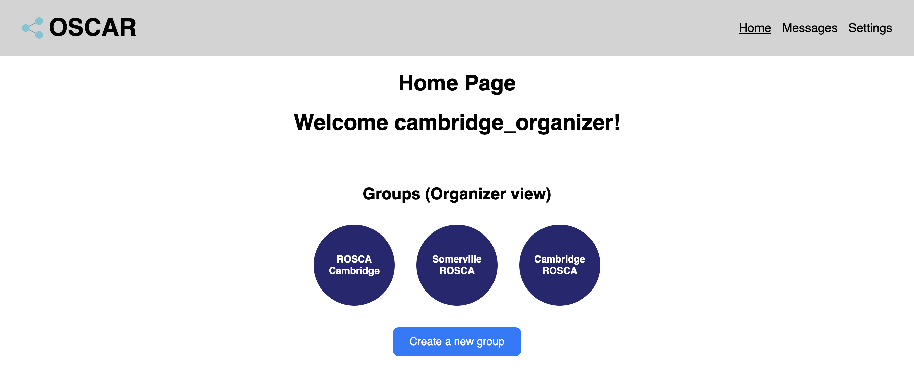

# Project Phase 5: Beta Release

## Deployment
- [Vercel](https://oscar-kappa.vercel.app/)
- [Github repository](https://github.com/angelwhipple/oscar)

## Concepts
1. Grouping
   - [Data model & actions](https://github.com/angelwhipple/oscar/blob/main/server/concepts/grouping.ts)
   - [Components](https://github.com/angelwhipple/oscar/tree/main/client/components/Grouping)
   - [Data store](https://github.com/angelwhipple/oscar/blob/main/client/stores/group.ts)
2. Permissioning
   - [Data model & actions](https://github.com/angelwhipple/oscar/blob/main/server/concepts/permissioning.ts)
   - [Components](https://github.com/angelwhipple/oscar/tree/main/client/components/Permission)
   - [Data store](https://github.com/angelwhipple/oscar/blob/main/client/stores/user.ts)
3. Accounting
    - [Data model & actions](https://github.com/angelwhipple/oscar/blob/main/server/concepts/accounting.ts)
4. Messaging
   - [Data model & actions](https://github.com/angelwhipple/oscar/blob/main/server/concepts/messaging.ts)
   - [Components](https://github.com/angelwhipple/oscar/tree/main/client/components/Messaging)
5. Notifying
   - [Data model & actions](https://github.com/angelwhipple/oscar/blob/main/server/concepts/notifying.ts)
   - [Components](https://github.com/angelwhipple/oscar/tree/main/client/components/Notifying)

## Syncs
- [routes.ts](https://github.com/angelwhipple/oscar/blob/main/server/routes.ts)

## Design Revisions
1. **Factored Grouping into Grouping & Accounting:** We decoupled the payment/accounting logic from the concept of grouping users together. This helped generalize our implementation, allowing for more interesting syncs. 
2. **Expanded scope of Permissioning:** We expanded user permissions from being field of ```Authenticating.User``` to being a standalone concept. This allowed us to broaden functionality and dynamically display content based on a user's role (member or organizer). 
3. **Deprioritized Scheduling:** Since Scheduling was not a central feature of our app, we excluded it from the final implementation. Instead, we prioritized concepts like Grouping, Accounting, and Messaging that spoke to our value proposition of community-based financial growth. 

## User Test Planning

#### Participants
1. **Sarla Pareek**, Housewife from Udaipur, India
   - **Rationale:** Sarla provides a real-world perspective of someone who uses and relies on ROSCAs for finalical planning. Testing our app with Sarla will help in uncovering usability issues and make sure our app is relevant to everyday members of a ROSCA, one of our primary target audiences.
2. **Rediet**, organizer of traditional ROSCAs (Equb)
   - **Rationale:** As an experienced ROSCA organizer, Rediet brings valuable insights into the apps utility in terms of group management. Tasks such as organizing contributions, sending reminders, and payouts. Testing our app with her would ensure our app meets expectations of users responsible for group coordination.
3. **Ashish Kumar Sedai**, Assistant Professor of Economics at UT Arlington
   - **Rationale:** Ashish has authored papers and extensively researches ROSCAs and hence, is a subject-matter expert in the field. Having talked to multiple people who participate in ROSCAs and advocating for marginalised communities who participate in these circles, Ashish’s feedback will help assess whether the app accurately represents these financial structures while balancing the needs of digitization and modern management tools.

#### Prepopulated data


#### Task list
|         Title          |                                                                          Instruction                                                                           |                                                                                                                              Rationale                                                                                                                              |
|:----------------------:|:--------------------------------------------------------------------------------------------------------------------------------------------------------------:|:-------------------------------------------------------------------------------------------------------------------------------------------------------------------------------------------------------------------------------------------------------------------:|
|      Join a ROSCA      | Join (or organize) your first group on the platform. If organizing, be sure to invite others to the group. If joining, accept an invitation from someone else. |                                    It's worth testing if the organizer/member structure is intuitive, too rigid, or just right. We can also learn whether the invite-only framework is feasible given the way the app is setup.                                     |
|  Make a contribution   |                                                              Contribute $100 to the savings pot.                                                               | Since we cannot do any real payment processing, our implementation for tracking money is somewhat limited. It's worth testing if our idea of digitally tracking contributions adds any value to the ROSCA system, or if we should focus on enhancing other aspects. |
|    Send a reminder     |                                           As an organizer, send a payment reminder out to your fellow group members.                                           |                           This task tests the notifying feature’s usability. It explores whether the user can efficiently send reminders and how effectively the system supports immediate communication between organizers and members.                            |
|   Distribute the pot   |                                      Assume you've won the pot for this round of the ROSCA cycle. Withdraw your earnings.                                      |                        Along with testing role specific permsissions, it assesses whether an organizer is supported enough to handle key financial operations like payouts, while restricting such actions for regular members of the ROSCA.                        |
|  Start a conversation  |                             You want to have a community-wide meeting soon. Start a chat on the topic with members of your ROSCA.                              |                              This would evaluate the mesasaging functionality and how it integrates with grouping. It would help identify potential hurdles in navigating or messaging that could hinder communication with the group.                              |