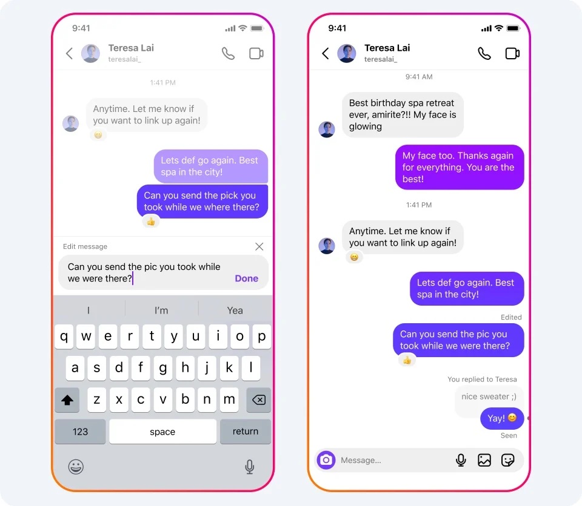
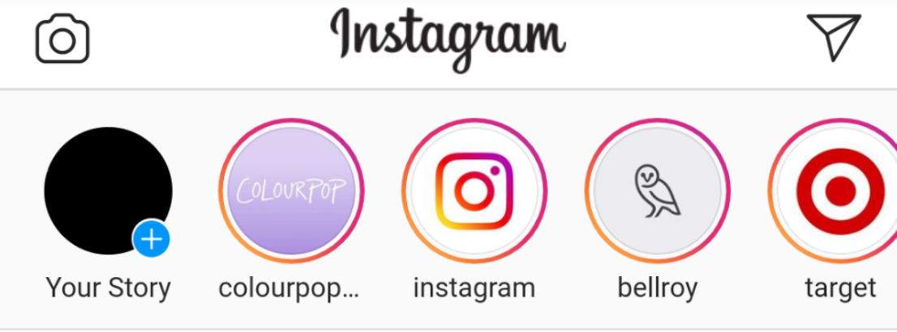
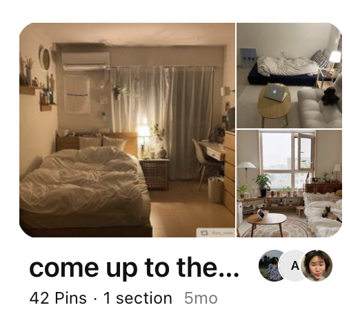
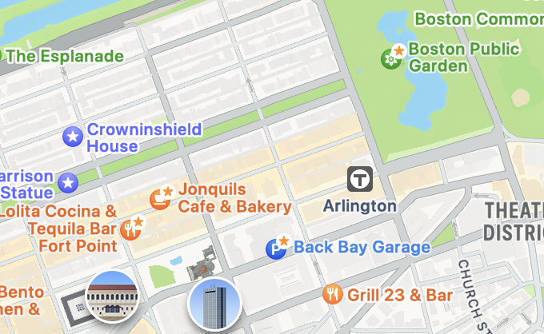
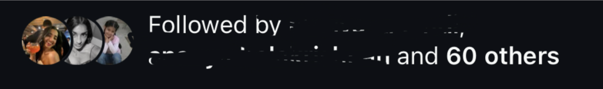

# Assignment 2: Divergent Design #
In this stage of the development process, I brainstormed the features, applications, and long-terms impacts of my app.

## The Application Goals ##
**Name**: Haven  
**Audience**: People of all ages, but primarily young users and users with small social circles  
**Values**: Haven is an app that provides individuals a space to  
1. Escape dangerous people lurking on social media
2. Invest their time and energy into existing relationships
3. Make intentional and safe connections

## The Comparables ##
1. **iMessage DM Interface** 
 
Could use this graphical representation of contacts as the central focus of Haven

2. **Instagram internal DM Interface** 
 
Could use the dynamic colors and ability to change the background to make the conversations you have more personal and fun!

3. **Instagram/Snapchat Stories**  
 
Could use the stories feature on instagram and snapchat to make a similar feature of temporary videos/photos you want to send to a group of contacts

4. **Instagram Mutual Friends Feature**  
 
Could use Instagrams ability to see mutual friends, but make it more prominent and centralized

5. **Pinterest Boards**  
 
Could use this kind of collaborative photo dumping feature to allow people to store/share photos with people and groups

6. **Apple Maps Starring Locations** 
 
Could apply this ability to start and save locations to peoples conversations and messages (saving quotes that are funny)

## The Brainstorm ##
1. **Connector** - central feature that connects users once given private id's of user1 and user2
2. **Lack of Username Search** - cannot add someone by searching for their name in a database (only by putting them in the connector) 
3. **Safety Spotlight** - as an introduction to the app, users are informed about CSAM on social media and are given resources to help 
4. **Mutual Friend Finder** - feature that notifies user if they have mutual friends and displays those friends. Includes option to block user if no mutual friends 
5. **Cut the Connection** - On each connections profile, there is a button to report this person for CSAM/SA. Leads to immediate legal action against them and blocks them. (More extreme than reporting them) 
6. **Emergency Connections** - ability to label some contacts as trusted sources/emergency contacts. Limited to 3. They will be notified when user "cuts connection" 
7. **Help Hotlines** - feature to call mental health, sexual assault hotline, or 911
8. **Consent Survey** - tracking feature that analyzes sent photos and if sexually explicit, surveys user if they consented to receive it or not. Only able to revoke consent in 3 days.  
9. **Burning** - Permanently deletes a photo (on both users' ends) that a user flags they did not consent to receive  
10. **Haven** - Central feature displaying your connections in graph structure
11. **Memories** - Collection of photos/videos shared bewteen connections that are available on a users profile
12. **RSVPs** - Ability to propose and send hangout invitations to connections by filling out a form
13. **Echoing** - Starring text messages to save as quotes to a connections profile
14. **Mood Signaling** - Ability to signal mood (through emojis) to connections and have it displayed on their Havens
15. **Podcast Room** - Ability to store and record audio chats between connections
16. **Hangout Tracking** - Tracking feature that allows you to visualizes in a calendar when you last made plans/hung out with a connection
17. **Calendar Integration** - External calendar integration to display availability between connections
18. **Connection Anniversary** - Feature that notifies user of anniversary of when they connected with someone
19. **Message Scheduling** - Feature to send messages at a chosen time and date in the future
20. **Glimpses** - Temporary videos/images a user can post for all their connections to see.

## The Value Sensitive Design (VSD) ##
### Stakeholders ###
1. **Direct Stakeholders**
- *Observation:*  If CSAM does circulate on the app, then law enforcement and or the government will likely be indirect stakeholders. 
- *Design Response:* To make it easier for law enforcement agencies to pursue the perpetrators, we could extend the Burning feature so that the “burned” photo would be sent to law enforcement immediately after burning. Or at least stored in a database that the users do not have access to so that agencies can quickly/easily access them. We could do the same if a photo was flagged as being non-consenually sent. 

2. **Non-targeted Use**
- *Observation:* Users could be the predators themselves, because we can’t filter out who exactly creates an account. They could use it to circulate CSAM among a private predatory community as opposed to actively preying on people.
- *Design Response:* It’s difficult to restrict who opts-in to your platform, but we can build disincentives, like the consent survey. Extending it further, we could implement a threshold system. If the platform detects a larger number of sexually explicit or distressing images in a short period of time, it could automatically ban the users who sent/received them and notify the authorities. 

### Time ###
3. **Reappropriation**
- *Observation:*  I can see how Haven could be used not just by friends/friend groups but by organized communities or teams. 
- *Design Response:* Could build a “team/organization” version of Haven (if the audience is large enough) that functions to foster genuine connections in the workplace. Not just a productivity or workflow tool like Slack, but something that builds positive office culture as that’s something that a lot of companies are beginning to value. 

4. **Adaptation** 
- *Observation:* Because Haven is made to sustain long-term, meaningful relationships, it could isolate people and make them less inclined to create new friendships or socialize. 
- *Design Response:* Could collaborate with local businesses/”third places” by recommending locations to hangout when a user wants to hangout with a connection. That way users can explore their location and meet new people while maintaining current connections. 

### Values ###
5. **Value Tension**
- *Observation:* Because my app grapples with CSAM it faces the same tensions of most social media apps: safety vs. privacy. Currently, it prioritizes safety (with the Connector, Safety Spotlight, Lack of Username Search, and Cut the Connection features). There are also some features that restrict a user’s privacy (like the consent survey, which would actively monitor users' photos).

- *Design Response:* This tension is unavoidable, so I think the best option would be establishing transparency: giving user’s the ability to make an educated decision about opting out of the platform by clearly communicating/educating to users on how the platform balances safety vs. privacy in the CSAM education section. 

## The Storyboard ##