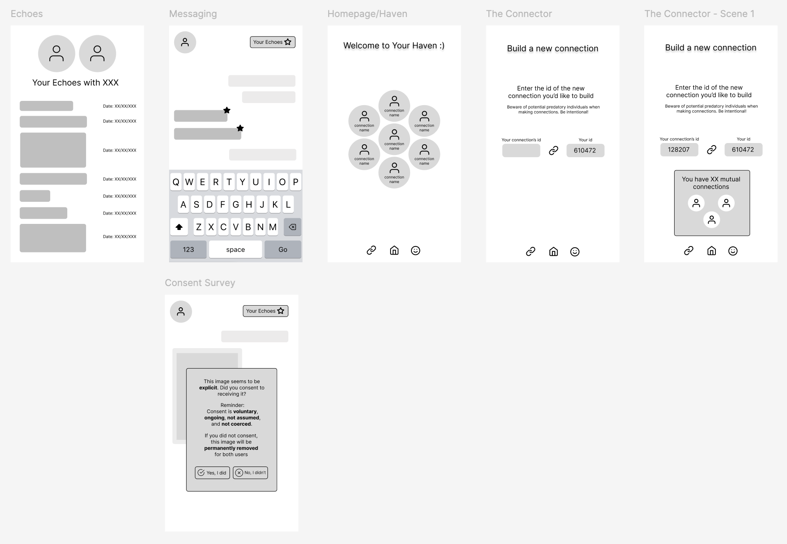

# Assignment 3: Convergent Design #
In this stage, I developed the concepts, synchronizations, and wireframes for the app

## Pitch ##
Haven is an app designed to protect. It’s hard nowadays to sustain meaningful relationships and avoid dangerous individuals hidden on social media. This app is made for individuals who want to keep their friends close, and make those friendships even closer.  
By centering the user experience around a select group of connections the user has, users will foster intentional and safe connections. With unique private user id’s, these connections are made only at the consent of both parties, and you are safe from being added by any unwanted users. Haven takes online child sexual abuse seriously, thus safety education, mutual consent, and reporting abuse are central features to the platform. But, we know relationships flourish most when you have fun, so with shared photo boards, message echoing, and podcast rooms, Haven is also a space that preserves. 

## Functional Design ##
**1. Concept: User**

*Purpose:* provides user with authentification and private access to their account.

*Principle* persona representation within the system with a name and system generated id

*State* <br>
`Users: set String, Number` <br>
`username: Users -> one String`<br>
`id: Users -> one Number`

*Action* <br>
`system generateId(out id: Number)` <br>
`register(name: String, id: Number)`

**2. Concept: Connecting[Person, Identifier]**

*Purpose:* establishes access between Persons to communicate

*Principle:* adding 2 identifiers into connector establishes a connection between them. Shows mutual connections between Persons before connecting

*State:*<br>
`Connector: set Identifier`<br>
`Connections: set Person`<br>
`user1: Connector -> one Number`<br>
`user2: Connector -> one Number`

*Action:*<br>
`system makeConnection(user1: Identifier, user2: Identifier, connector, connections)`<br>
`system mutuals(user1: Identifier, user2: Identifier)`<br>
`cancelConnection(user1: Identifier, user2: Identifier)`

**3. Concept: Homepage[Person, Connection]** 

*Purpose:* a central location to view and access all connections

*Principle:* after creating a connection, homepages are updated to reflect the new connection

*State:*<br>
`Connections: set Person` <br>
`connection: Connections -> one Person`

*Action:*<br>
`system displayConnections(Connections)`<br>
`accessConnection(connection: Person)`

**4. Concept: Messaging[Sender, Receiver]**

*Purpose:* contacting via sending direct messages 

*Principle:* after a sender sends a message, the receiver will receive it

*State:* <br>
`sender: one Sender` <br>
`receiver: one Receiver` <br>
`message: one Message` <br>
`messageHistory; set Message`

*Action:*<br>
`sendMessage(message: Message, sender, receiver, out messageHistory)`


**5. Concept: ConsentSurvey[Content]**

*Purpose:* manages potentially non-consentually received content

*Principle:* presents options to indicate explicit content was non-consentually received and removes it if necessary

*State:*<br>
`content: one Content`<br>
`isExplicit: Boolean` <br>
`consent: Boolean` <br>
`toRemove: Boolean`

*Action:*<br>
`system scanContent(content: Content, out isExplicit)` <br>
`system survey(isExplicit)`<br>
`indicateConsent(consent, out toRemove)`<br>
`system removeContent(toRemove)` <br>

**6. Concept: Labelling[Item]**

*Purpose:* to organize items

*Principle:* adding label to item groups items and displays them together

*State:*<br>
`item: one Item`<br>
`label: one String`<br>
`labeledItems: set Item`

*Action:*<br>
`addLabel(item: Item, label, out labeledItems)`<br>
`removeLabel(item: Item, label, out labeledItems)`

### Synchronizations ###

```
app Haven
    include User, Connecting[User, User.id], Homepage[User, Connecting.connections], Messaging[User, User], ConsentSurvey[Messaging.message], Labelling[Messaging.message]

    sync register(name)
        when User.generateId() //returns the id to use in register
            User.register(name, id)

    system sync homepage(connections: Users)
        Homepage.displayConnections(connections)

    sync message(message: Message, user1: User, user2: User)
        if user2 in user1.connections:
            Message.sendMessage(message, user1, user2) 
    
    sync connect(user1: User.id, user2: User.id, connector: set User.id, connections: set Users)
        Connector.makeConnection(user1, user2, connector, connections)
        Homepage.displayConnection(connections)

    system sync consentSurvey(message: Message, isExplicit: Boolean, consent: Boolean, toRemove: Boolean)
        Message.sendMessage(message, user1, user2)
        ConsentSurvey.scanContent(message)
        ConsentSurvey.survey(isExplicit)
        ConsentSurvey.indicateContent(consent)
        ConsentSurvey.removeContent(toRemove)

    sync label(message: Message, label: String):
        addLabel(message, label)

    sync undoLabel(message: Message, label: String):
        removeLabel(message, label)

```

### Figma Wireframe ###

Link to Wireframe: https://www.figma.com/design/EXVqFTV82VI4RUgPvlKq3W/Untitled?node-id=1-2&node-type=canvas&t=IbElmNPo5BvGhNEr-0

### Design Tradeoff ###
**1. Id Generator/Availability**
One design tradeoff I encountered was whether it was better to make each user's unique id generated by the system or chosen by the user, and whether to keep the id public to the user or not. I decided to make it generated by the system and “hidden” from the user, because I figured it would result in a more private experience where the user doesn’t have to worry about someone they don’t know adding them or them accidentally giving it away. It would only display when you are connecting with someone. This does make it harder to make connections, but the goal is that those connections are made with intention.

**2. Consent Survey Scanning**
Another design tradeoff I considered was whether it would be best to have the system scan every message sent between users to determine if it's explicit, or whether it’s better to have someone proactively indicate to themselves that they didn’t consent to receiving it. The system scanning definitely limits personal privacy, but oftentimes individuals don’t consider that content as digital harassment, and if they do, they can’t bring themselves to report it. I may change this design decision, but for now, I’m choosing user safety over privacy in this case.

**3. Message/Label Syncing**
One last design tradeoff I considered was whether my Messaging concept and my Labeling concept would sync up in addition to Label having an extrinsic dependency on Messaging. Originally I thought they'd have to sync up. But in the end, I realized that a user can label a message whenever they choose, not necessarily right when a friend sends a message or when they do, so there is no need to sync the two, but the dependency definitely remains.
