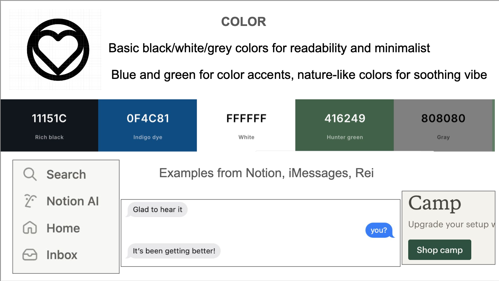
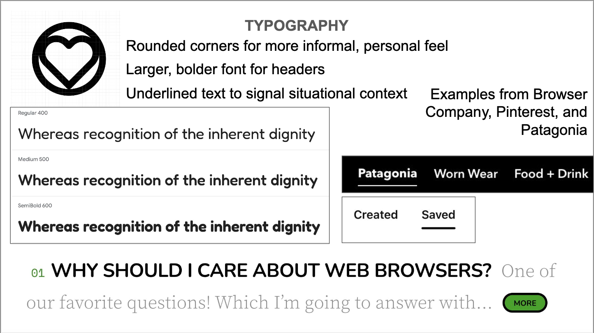

# Assignment 5: Final Front-end Design and Implementation #
In this assignment, I finish implementing the client side of my web app and conduct a visual design study.

## Visual Design Study ##
Link to Visual Design Study:

 

## Github and Vercel Deployment ##
Github Link: https://github.com/ashi-kamra/assignment5
Vercel Deployment: https://assignment5-k9epy6d9t-ak118s-projects.vercel.app/

## ChatGPT Credits ##
I used chatGPT to better understand how to structure my components, and how to access values passed between the client and server routes. I also used it to help style the messaging component so it resembled the standard of direct messaging UIs.

